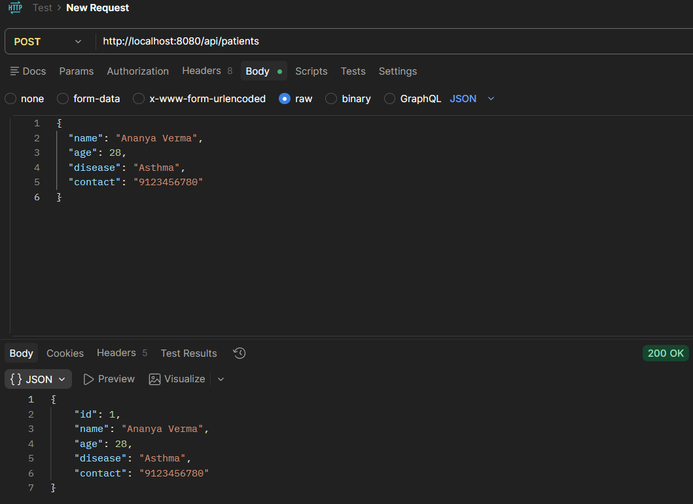
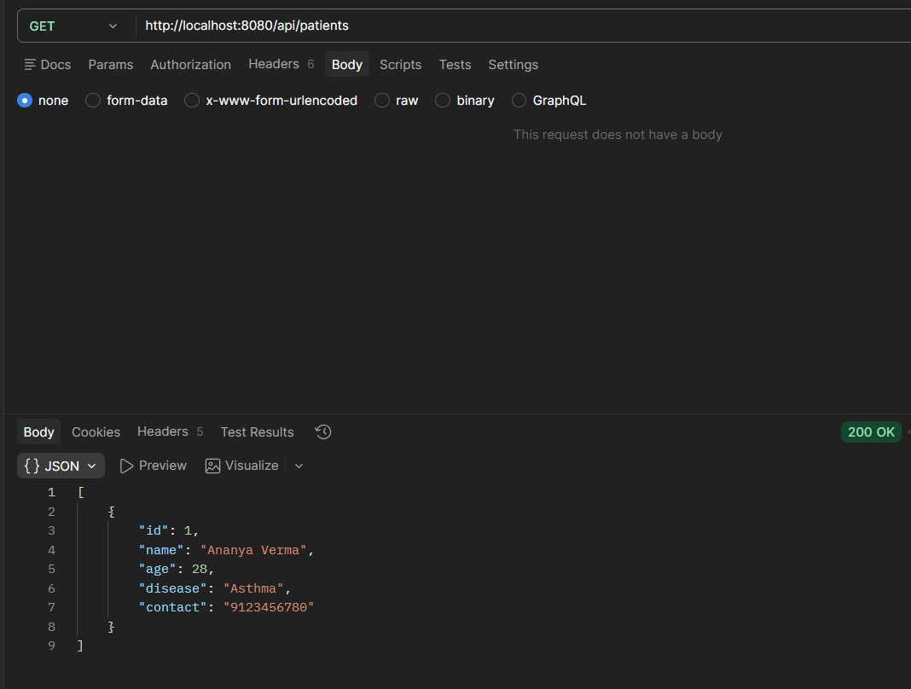
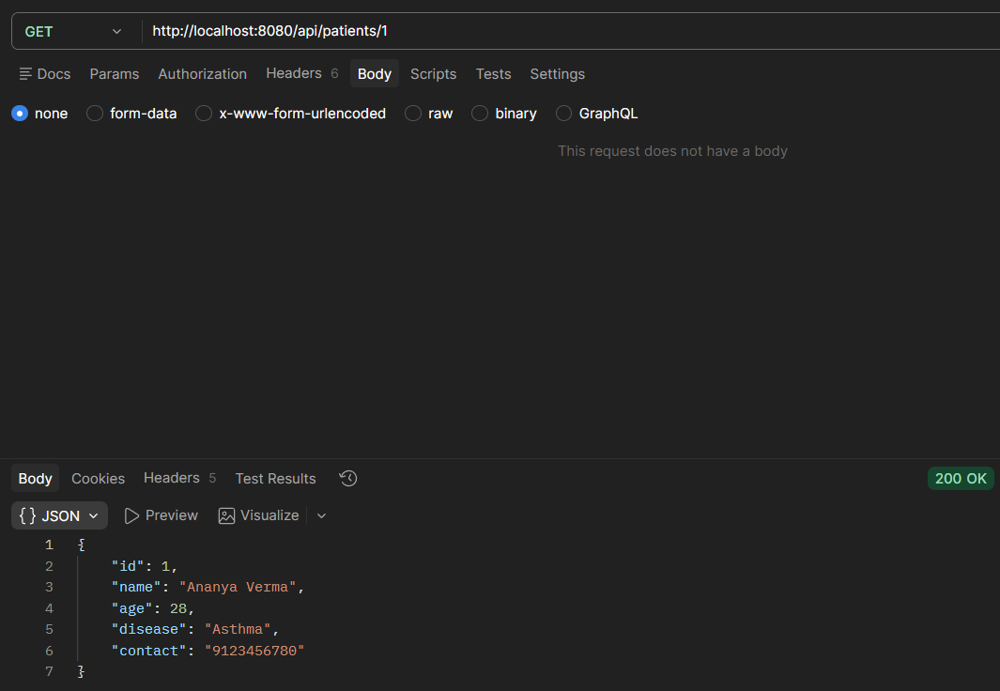
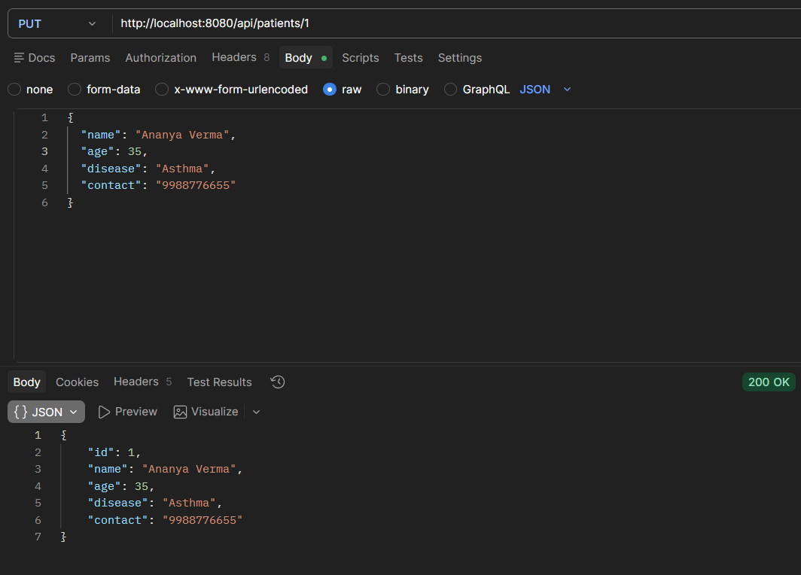
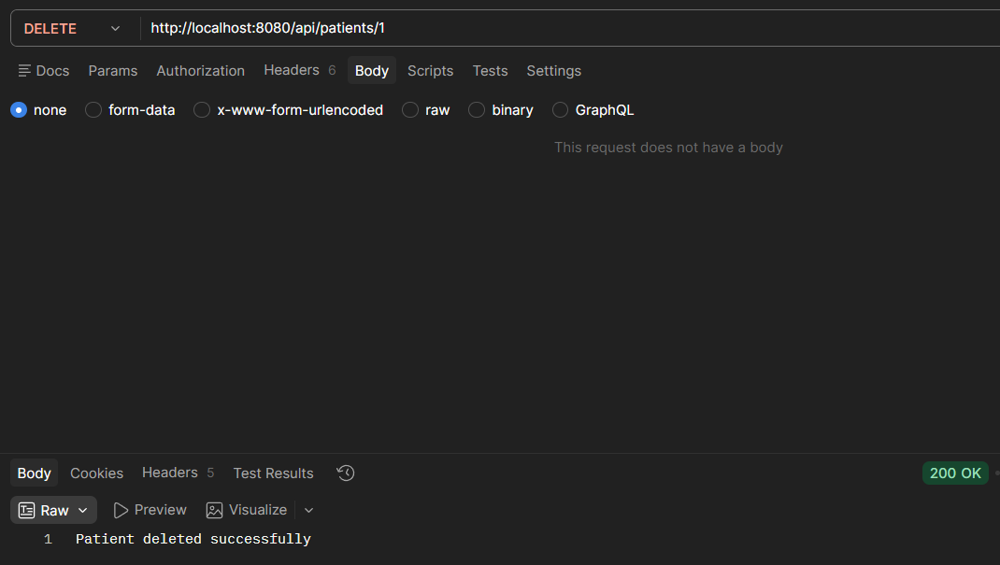

# Experiment 6: Patient Records CRUD Service

## Project Description

This application is a REST API developed using Spring Boot that handles patient information. It supports all essential CRUD operations — Create, Read, Update, and Delete. The project uses an in-memory H2 database, making it simple to run and test without external database setup.

---

## Technology Stack

- **Backend Framework:** Spring Boot 4.0.4  
- **Programming Language:** Java 17  
- **Database:** H2 (In-Memory)  
- **Libraries Used:** Spring Web, Spring Data JPA, Lombok  

---

## How to Run the Project

1. Download or clone this repository.
2. Open the project folder (`healthhub`) in any Java IDE (IntelliJ, Eclipse, etc.).
3. Locate and run the main class: `PatientCrudApiApplication.java`.
4. The application will be available at:  
   `http://localhost:8080`

---

## API Routes & Usage

All endpoints are prefixed with: `/api/patients`

---

### 1. Add a New Patient (POST)

This endpoint inserts a new patient into the database. The system automatically assigns an ID.

- **Endpoint:** `POST http://localhost:8080/api/patients`
- **Request Body:**

```json
{
  "name": "Ananya Verma",
  "age": 28,
  "disease": "Asthma",
  "contact": "9123456780"
}
````

#### Sample Response (Postman)



---

### 2. Fetch All Patients (GET)

Returns a list of all patient records stored in the system.

* **Endpoint:** `GET http://localhost:8080/api/patients`
* **Request Body:** Not required

#### Sample Response (Postman)



---

### 3. Fetch Patient by ID (GET)

Retrieves details of a single patient using their ID.

* **Endpoint:** `GET http://localhost:8080/api/patients/1`
* **Request Body:** Not required

#### Sample Response (Postman)



---

### 4. Modify Patient Details (PUT)

Updates an existing patient’s information.

* **Endpoint:** `PUT http://localhost:8080/api/patients/1`
* **Request Body:**

```json
{
  "name": "Ananya Verma",
  "age": 35,
  "disease": "Asthma",
  "contact": "9988776655"
}
```

#### Sample Response (Postman)



---

### 5. Remove Patient (DELETE)

Deletes a patient record from the system based on ID.

* **Endpoint:** `DELETE http://localhost:8080/api/patients/1`
* **Request Body:** Not required

#### Sample Response (Postman)



---
