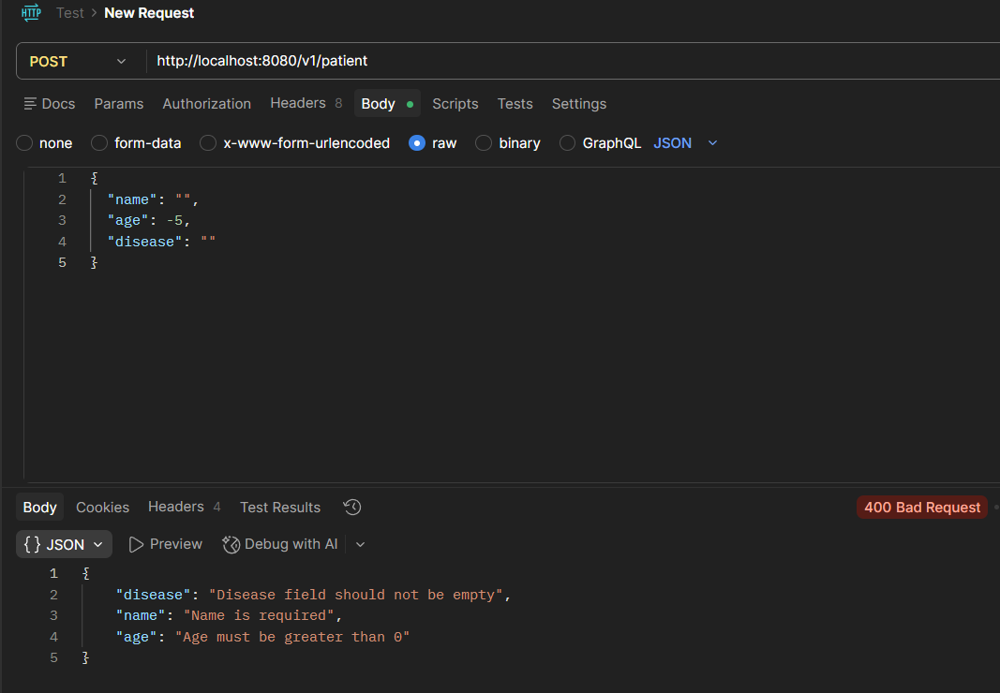
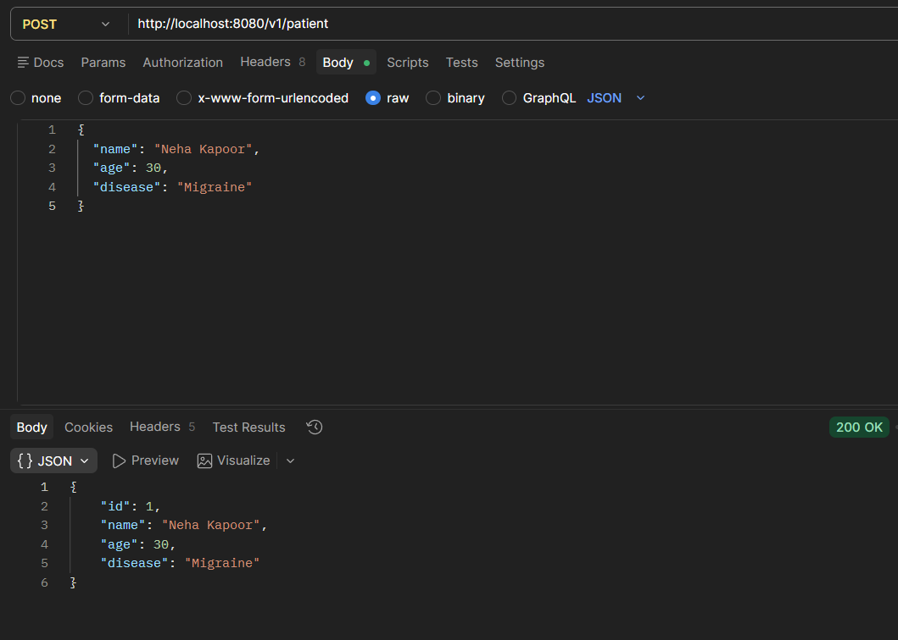
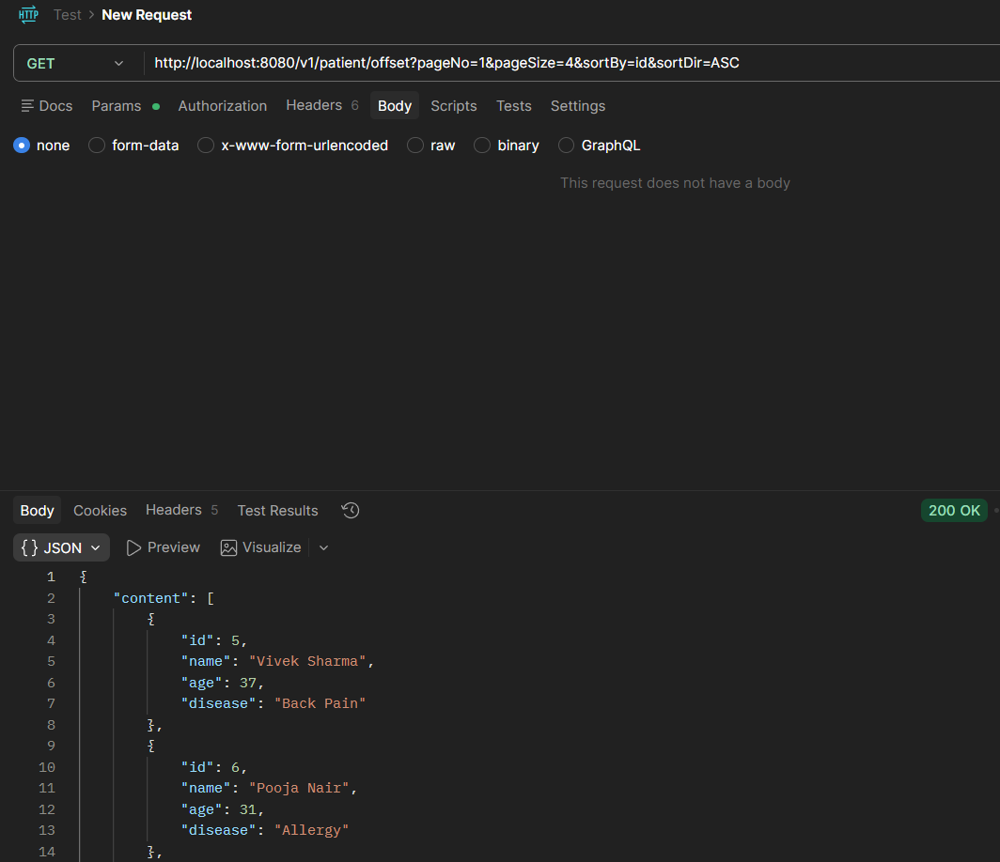
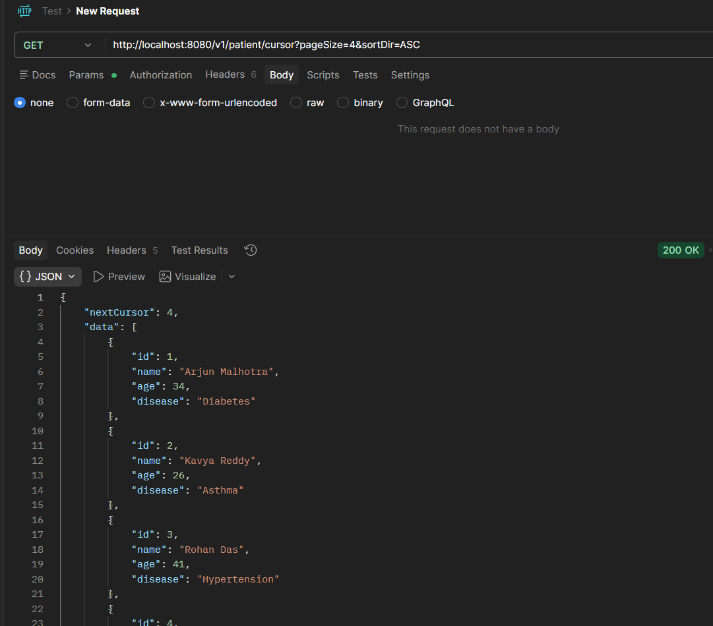
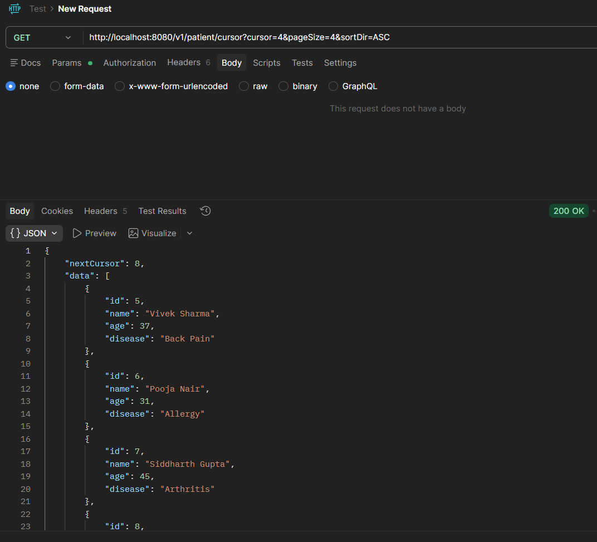

# Experiment 7: Enhanced API Design (Validation & Pagination)

## Project Summary

This project extends a basic Spring Boot CRUD application into a more structured and production-style API. Instead of exposing database entities directly, the system uses **DTOs (Data Transfer Objects)** combined with validation rules to ensure clean and reliable data handling.

In addition, the API efficiently manages large datasets by supporting two pagination techniques:
- **Offset-based pagination** (traditional approach)
- **Cursor-based pagination** (optimized for performance and scalability)

---

## Testing with Postman

Below are test cases demonstrating validation and pagination features.

---

### 1. Validation Check (Invalid Input)

**Purpose:** Ensure that invalid data is blocked using validation annotations (`@Valid`) defined in the DTO layer.

- **Method:** `POST`
- **URL:** `http://localhost:8080/v1/patient`
- **Request Body:**

```json
{
  "name": "",
  "age": -5,
  "disease": ""
}
````

* **Expected Response:**

  * Status: `400 Bad Request`
  * Response body contains validation error messages such as:

    * "Name cannot be empty"
    * "Age must be positive"

#### Output Preview



---

### 2. Successful Data Submission

**Purpose:** Confirm that valid data passes validation, gets converted into an entity, and is stored in the database.

* **Method:** `POST`
* **URL:** `http://localhost:8080/v1/patient`
* **Request Body:**

```json
{
  "name": "Neha Kapoor",
  "age": 30,
  "disease": "Migraine"
}
```

* **Expected Response:**

  * Status: `200 OK`
  * Returns the saved object including a generated `id`

#### Output Preview



---

### 3. Offset Pagination (Page-Based)

**Purpose:** Demonstrate standard pagination using page number and size parameters via Spring Data JPA.

* **Method:** `GET`

* **URL:**
  `http://localhost:8080/v1/patient/offset?pageNo=1&pageSize=4&sortBy=id&sortDir=ASC`

* **Expected Response:**

  * Status: `200 OK`
  * Returns:

    * A list of 4 records
    * Metadata such as total pages, total elements, etc.

#### Output Preview



---

### 4. Cursor Pagination (Efficient Scrolling)

**Purpose:** Show a more efficient pagination method suited for large datasets and infinite scrolling scenarios.

* **Method:** `GET`

* **First Request:**

```
http://localhost:8080/v1/patient/cursor?pageSize=4&sortDir=ASC
```

* **Next Request Example:**

```
http://localhost:8080/v1/patient/cursor?cursor=4&pageSize=4&sortDir=ASC
```

*(Here, `cursor=4` represents the last received ID from the previous response.)*

* **Expected Response:**

  * Status: `200 OK`
  * JSON structure:

    * `data`: list of records
    * `nextCursor`: value for fetching the next batch

#### Output Preview




---